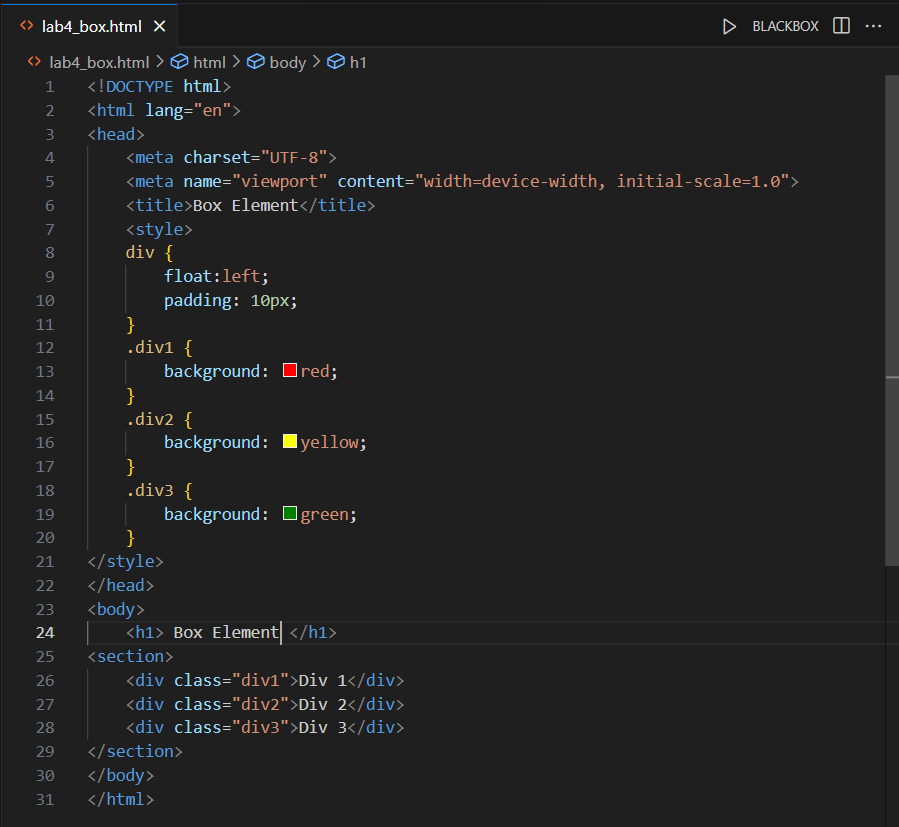
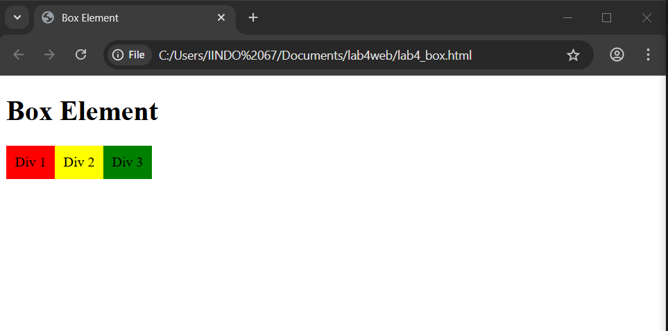
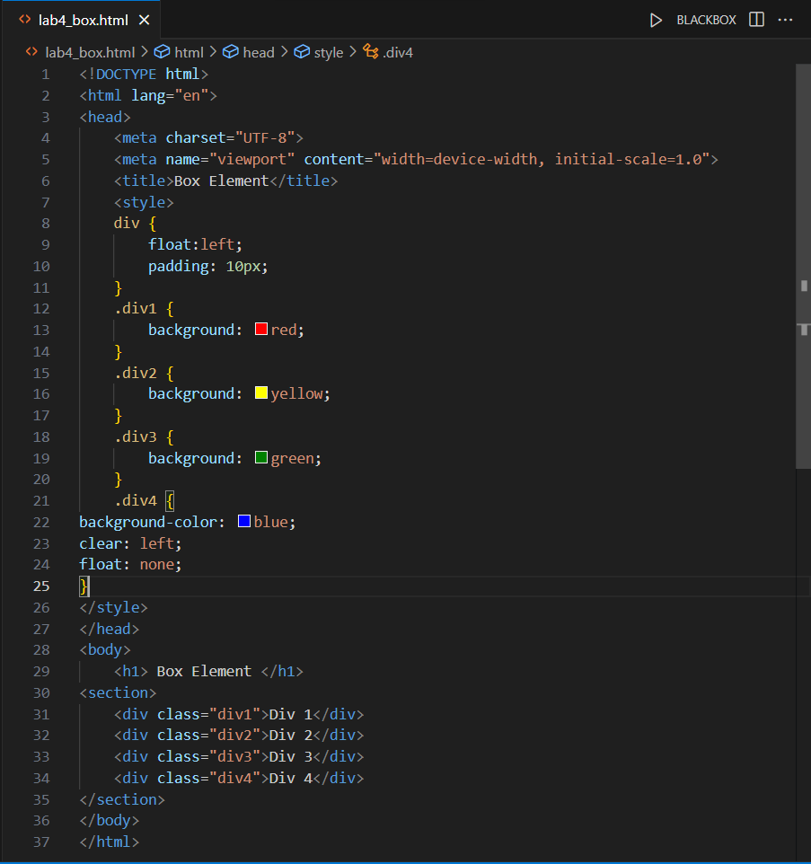

# Lab4Web
Nama: Den Fahmi Satria 

Nim: 312410523 

Kelas: TI.24.A5 

## Praktikum 4: CSS Layout
### Langkah-Langkah Praktikum
Persiapan membuat dokumen HTML dengan nama file lab4_box.html, menambahkan deklarasi CSS pada head untuk membuat float element, dan menambahkan box element seperti berikut.
 

dan hasilnya sebagai berikut. 

 

Saya menambahkan element div lainnya seteleah div3, Kemudian saya atur property clear pada CSS, seperti berikut.
 

hasilnya seperti berikut
