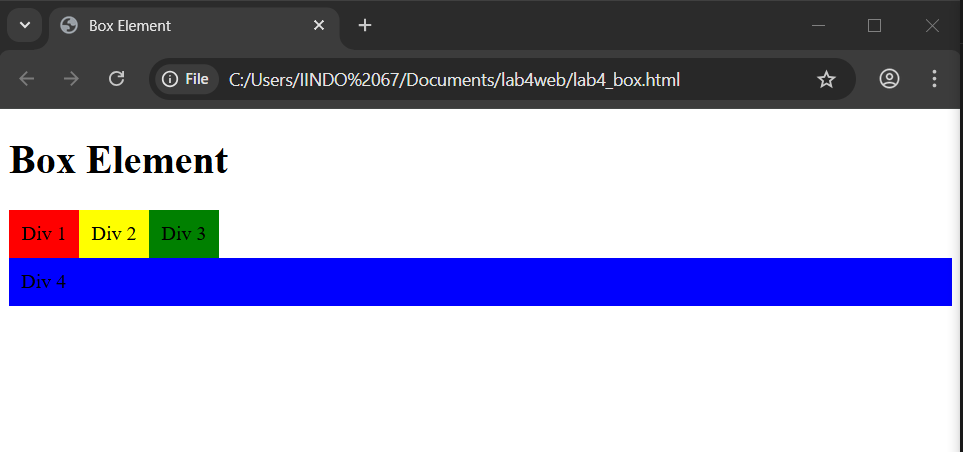
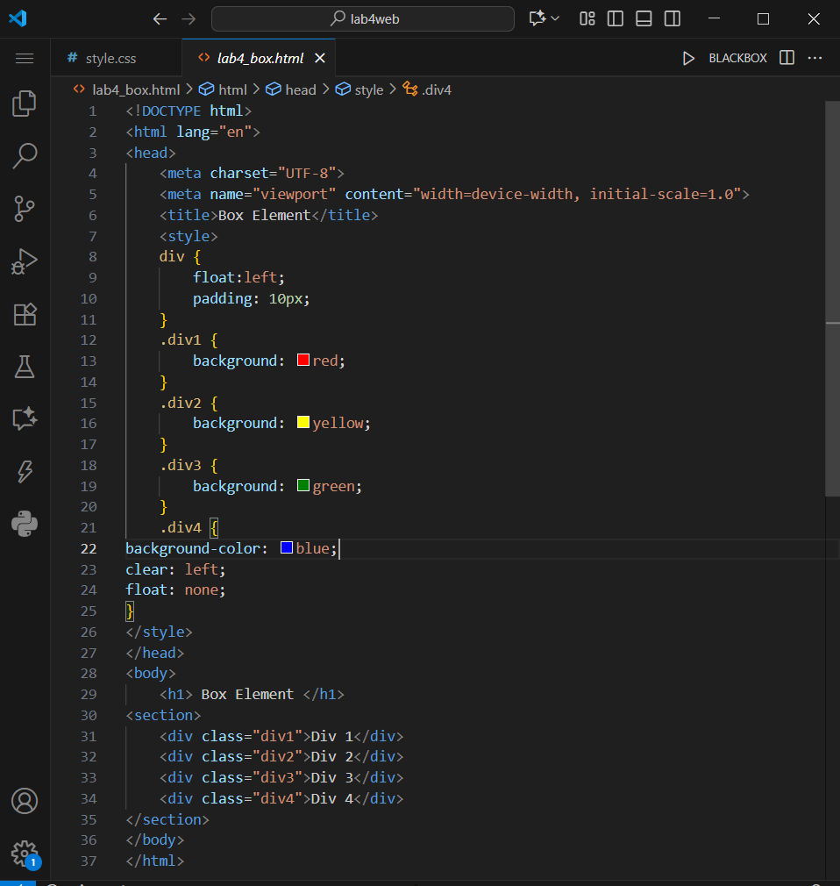
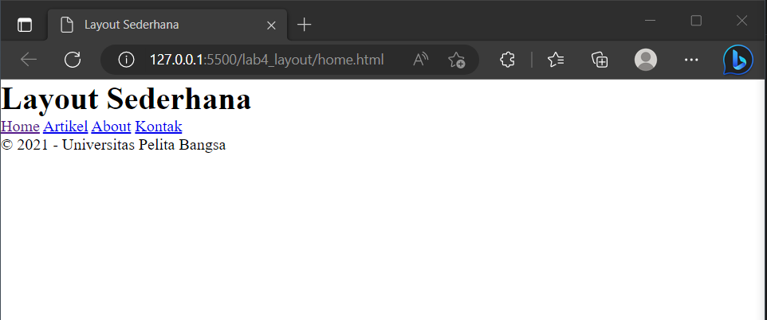
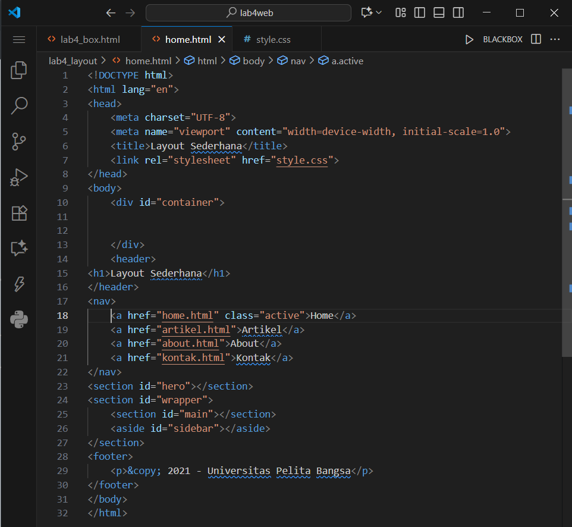

# Lab4Web
Nama: Den Fahmi Satria 

Nim: 312410523 

Kelas: TI.24.A5 

# Praktikum 4: CSS Layout
## Langkah-Langkah Praktikum
### Persiapan membuat dokumen HTML dengan nama file lab4_box.html, menambahkan deklarasi CSS pada head untuk membuat float element, dan menambahkan box element seperti berikut.
 

### dan hasilnya sebagai berikut.
 

### Saya menambahkan element div lainnya seteleah div3, Kemudian saya atur property clear pada CSS, seperti berikut.
 

### hasilnya seperti berikut
 

### Membuat layout sederhana
#### Saya membuat folder baru dengan nama lab4_layout, kemudian saya membuat file baru didalamnya dengan nama home.html, dan file css dengan nama style.css seperti berikut.
 

### hasilnya sebagai berikut
 

### lalu saya mengatur navigasi menggunakan code berikut
 

### berikut hasilnya
 

