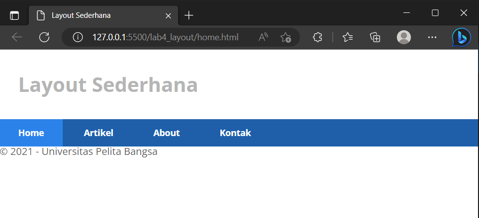

# Lab4Web
Nama: Den Fahmi Satria 

Nim: 312410523 

Kelas: TI.24.A5 

# Praktikum 4: CSS Layout
## Langkah-Langkah Praktikum
### Persiapan membuat dokumen HTML dengan nama file lab4_box.html, menambahkan deklarasi CSS pada head untuk membuat float element, dan menambahkan box element seperti berikut.
 

### dan hasilnya sebagai berikut.
 

### Saya menambahkan element div lainnya seteleah div3, Kemudian saya atur property clear pada CSS, seperti berikut.
 

### hasilnya seperti berikut
 

### Membuat layout sederhana
#### Saya membuat folder baru dengan nama lab4_layout, kemudian saya membuat file baru didalamnya dengan nama home.html, dan file css dengan nama style.css seperti berikut.
 

### hasilnya sebagai berikut
 

### lalu saya mengatur navigasi menggunakan code berikut
 

### berikut hasilnya
 

### Kemudian saya memasukkan Hero panel di home.html sebagai berikut.
 

### dan inilah hasilnya
 

### Kemudian saya menambahkan element widget dalam sidebar seperti berikut.
 

 

### dan inilah hasilnya
 

### Selanjutnya saya mengatur tampilan footer. Tambahkan CSS untuk footer dan menambahkan Elemen lainnya pada Main Content sebagai berikut.
 

 

### berikut hasilnya
 

### Selanjutnya saya membuat content artikel. Dan menambahkan HTML dan css berikut pada main content.
 

 

### berikut hasilnya
 

## Pertanyaan dan tugas
### 1. Tambahkan Layout untuk menu About
### => buat single layout yang berisi deskripsi, portfolio, dll
### 2. Tambahkan layout untuk menu Contact
### => yang berisi form isian: nama, email, message, dll

## Jawaban
### untuk About, saya membuat file lagi dengan nama about.html di dalam folder yang sama dengan Home.html seperti berikut.

### untuk Menu Contact, saya membuat file dengan nama kontak.html di dalam folder yang sama dengan Home.html seperti berikut

### dan berikut adalah hasil dari kedua file tersebut
 

 

